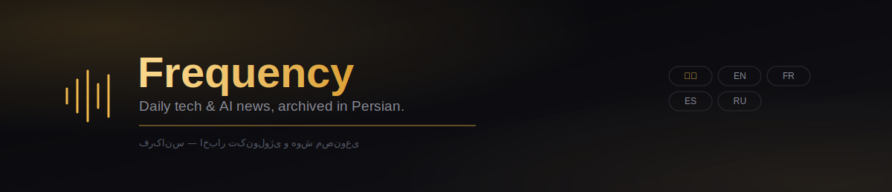
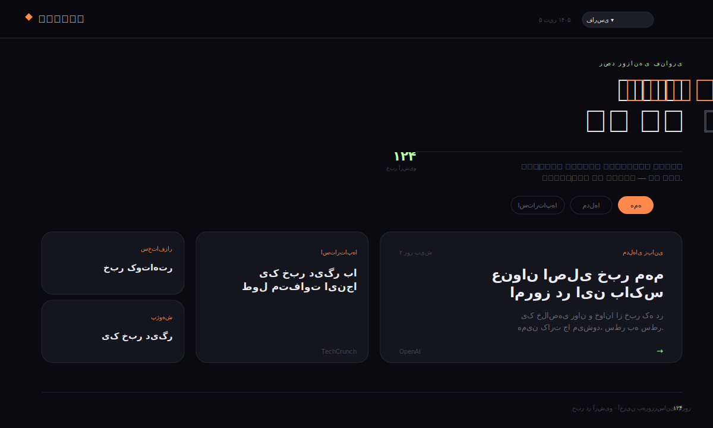

<div align="center">



<br/>


<br/>

**A daily, self-updating archive of tech & AI news — collected, translated to Persian, and stored as clean structured data.**
Runs entirely on free infrastructure: GitHub Pages + GitHub Actions + the Gemini API.

<br/>



</div>

<br/>

## ◆ Table of Contents

- [What This Is](#-what-this-is)
- [Files in This Repo](#-files-in-this-repo)
- [Two Ways to Run It](#-two-ways-to-run-it)
- [Reading in Other Languages](#-reading-in-other-languages)
- [News Record Structure](#-news-record-structure)
- [License](#-license)

<br/>

## ◆ What This Is

Frequency (فرکانس) pulls the day's most important tech and AI stories from a handful of trusted sources, summarizes them in Persian using the Gemini API, and archives every article as a structured JSON record — building a dataset that grows richer every single day.

<table>
<tr>
<td width="50%" valign="top">

**✦ Fully automated**
A GitHub Actions workflow runs daily, fetches new stories, translates them, and commits the updated dataset — zero manual work.

**✦ Magazine-style feed**
An asymmetric mosaic grid, a slide-in reading panel, and a live scroll-progress rail — built from scratch, no template.

</td>
<td width="50%" valign="top">

**✦ A growing dataset**
Every article is stored as clean, structured JSON — ready for analysis down the line, not just for display.

**✦ Free to run**
No paid hosting, no paid API tier required — GitHub's free plan covers all of it.

</td>
</tr>
</table>

<br/>

## ◆ Files in This Repo

```
tech-news-fa/
├── index.html                    → The site itself (reads news-dataset.json)
├── news-dataset.json              → The archive — always stored in Persian
├── update_news.py                 → Fetches feeds, translates via Gemini, updates the dataset
├── requirements.txt                → Python dependencies for update_news.py
├── .github/workflows/
│   └── update-news.yml              → Runs update_news.py automatically, every day
├── SETUP.md                        → Step-by-step guide to the free automation setup
├── assets/                         → README banner & preview images
└── README.md
```

<br/>

## ◆ Two Ways to Run It

**Path 1 · Just view it locally (no automation)**

Keep `index.html` and `news-dataset.json` in the same folder and open `index.html` in a browser. To refresh the archive later, regenerate `news-dataset.json` and swap it in.

> If opening the file directly (`file://`) gives you a CORS error, serve it locally instead:
> ```bash
> python3 -m http.server 8000
> ```
> then visit `http://localhost:8000`.

**Path 2 · Full, free automation (recommended)**

Follow **[SETUP.md](./SETUP.md)** step by step. After a one-time setup (about 15 minutes), the site updates itself every day — for free, powered by GitHub Actions and the Gemini API.

<br/>

## ◆ Reading in Other Languages

The archive (`news-dataset.json`) is always written and stored **in Persian** — `update_news.py` and the daily automation are unchanged.

`index.html` now includes a language switcher (فارسی / English / Français / Español / Русский) in the header. Choosing a language other than Persian translates the visible headlines and summaries **on the fly, in the browser**, using the free [MyMemory](https://mymemory.translated.net/) translation API — the underlying dataset is never modified or re-saved in another language. Translations are cached in the browser (`localStorage`) so repeat visits don't re-translate the same text.

<br/>

## ◆ News Record Structure

```json
{
  "id": "unique id (hash of the article URL)",
  "date": "publish date, Gregorian (YYYY-MM-DD)",
  "source": "source name",
  "source_url": "link to the original article",
  "category": "topic category",
  "title_fa": "Persian title",
  "title_en": "original English title",
  "summary_fa": "Persian summary",
  "tags": ["key tags"]
}
```

After a few months (or years) of daily data, this JSON file becomes a dataset you can hand to a Python/pandas script — or to Claude — to analyze how the AI industry's `category`, `tags`, and `date` trends shift over time.

<br/>

## ◆ License

MIT — free to use, modify, and share.

<div align="center">
<br/>
<sub>◆ Collected daily. Archived in Persian. Read in whatever language you like.</sub>
</div>
